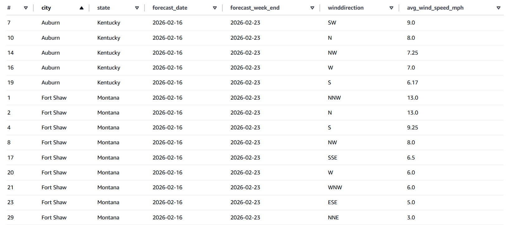
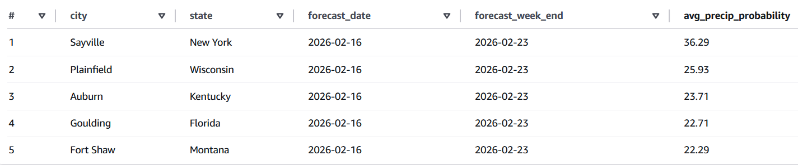
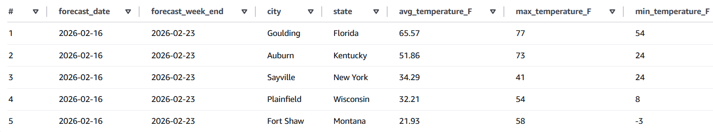

# AWS Weather Data API Project
This repo contains an outline for AWS infrastructure to select a random city from uscities.csv and use its longitude and latitude to retrieve weather data via [an API](https://api.weather.gov) based on a schedule, and to process it using AWS's cloud based DE tools.

## Tools used: 
- **AWS Lambda** – Serverless data processing  
- **S3** – Storage for raw and curated data  
- **EventBridge** – Scheduled invocation of Lambda  
- **IAM** – Roles and permissions for Lambda and services  
- **Glue Crawler** – Automatically infer schema from Parquet  
- **Athena** – Querying structured data with SQL  

## Architecture Overview:
1. **EventBridge Rule**: Triggers `fetch_weather_data` Lambda daily.
2. **Fetch Lambda**: Pulls weather data from an API and saves raw JSON to S3 (`raw/` folder, partitioned by date).
3. **S3 ObjectCreated Trigger**: Invokes `clean_weather_data` Lambda when new JSON arrives.
4. **Clean Lambda**: Flattens JSON and saves as Parquet in `curated/` folder.
5. **Glue Crawler**: Crawls Parquet files and updates the Athena Data Catalog.
6. **Athena**: Query the curated dataset with SQL.

## Notes
- This project was created using an AWS Free Tier account
- Data is partitioned by year/month/day in S3 for efficient Athena querying
- Lambda functions utilize layers for Python package dependencies
- Glue Crawler is ran on a daily schedule to update the catalog utilized by Athena

## File & Folder Structure:
```text
├── README.md
├── architecture-diagram.png
│
├── lambdas/
│   ├── fetch_weather_data/
│   │   ├── lambda_function.py
│   │   └── README.md
│   │
│   ├── clean_weather_data/
│   │   ├── lambda_function.py
│   │   ├── README.md
│   │   └── test_event.json
│   │ 
│   └── layers/
│       └── README.md
│
├── queries/
│   ├── create_view.sql
│   ├── avg_temp_by_city.sql
│   ├── avg_winddirection_speed_by_city.sql
│   └── top_city_by_precip_prob.sql
│
├── sample_data/
│   ├── raw_sample.json
│   └── cleaned_sample.json
│
└── weather-config/
    └── uscities.csv
```

## Example queries 

### avg_winddirection_speed_by_city.sql
This query aggregates by city, state, wind direction, and forecast week to show the average wind speed direction (MPH) based on each direction. 


```sql
SELECT
    city,
    state,
    forecast_date,
    forecast_date + INTERVAL '7' DAY AS forecast_week_end,
    winddirection,
    ROUND(AVG(CAST(regexp_extract(windspeed, '([0-9]+)', 1) AS INTEGER)), 2) AS avg_wind_speed_mph
FROM curated_weather_analytics
WHERE winddirection IS NOT NULL AND trim(winddirection) <> ''
GROUP BY city, state, forecast_date, forecast_date + INTERVAL '7' DAY, winddirection
ORDER BY avg_wind_speed_mph DESC;
```

### top_city_by_precip_prob.sql
This query aggregates by city, state, and forecast week to show top cities based on the average of preciptation for the week.


```sql
SELECT
    city,
    state,
    forecast_date,
    forecast_date + INTERVAL '7' DAY AS forecast_week_end,
    ROUND(AVG(probabilityofprecipitation_value), 2) AS avg_precip_probability
FROM curated_weather_analytics
WHERE probabilityofprecipitation_value IS NOT NULL
GROUP BY city, state, forecast_date, forecast_date + INTERVAL '7' DAY
ORDER BY avg_precip_probability DESC
LIMIT 10;
```

### top_city_by_precip_prob.sql
This query aggregates by city, state, and forecast week to show the average temperature, min, and max temperature in F for that week.


```sql
SELECT
    forecast_date,
    forecast_date + INTERVAL '7' DAY AS forecast_week_end,
    city,
    state,
    ROUND(AVG(temperature), 2) AS avg_temperature_F,
    MAX(temperature) AS max_temperature_F,
    MIN(temperature) AS min_temperature_F
FROM curated_weather_analytics
GROUP BY forecast_date, forecast_date + INTERVAL '7' DAY, city, state
ORDER BY avg_temperature_F DESC;
```
